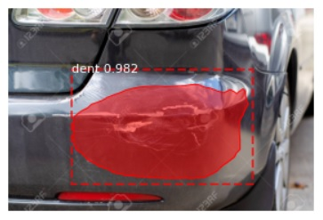
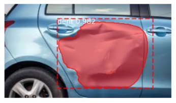
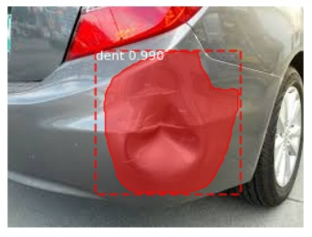
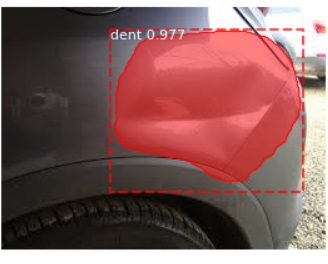
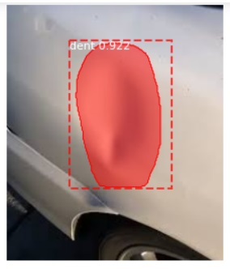
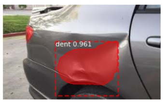

# VehicleDamageDetection
AI which provides detailed report on any vehicle's damage regions and status

This AI is built using Tensorflow machine learning which is an adaptation of Mask RCNN model of @aktwelve. The images are annotatedusing VGG Image Annotator tool.

# Usage
This software can be used in 
1) Vehicle rental companies
2) Insurance companies
3) Car wash companies

# Get Started

1) Git clone this repo or download the zipped file. Unzip the inner file to a convenient location

2) Clone and unzip @aktwelve's mask rcnn implementation and unzip into the inner file of this repo.

4) Get the images from google images or kaggle. Split the images in 80:20 ratio and place the former in datasets/cigg_butts/train/images and latter into datasets/cigg_butts/val/images

5) Use the VGG image annotator tool to annotate the images and place coco annotations of each dataset in the train and val directories respectively.

6) Open jupyter notebook from the console and open "./mask_rcnn/MaskRCNN_TrainAndInference.ipynb"

7) Follow the commands presented in the notebook.

Try it out: http://68.183.233.92/

# Web App 
The website file is DentDetection.7z . Unzip it and activate it using flask in the terminal. Instructions are on the website which allows the user to upload files and detect the dents.
1) Use `pip install -r requirements.txt` to install all the packages necessary to run the Web App.
2) Run `python3 server_new.py' 

# Have fun!
